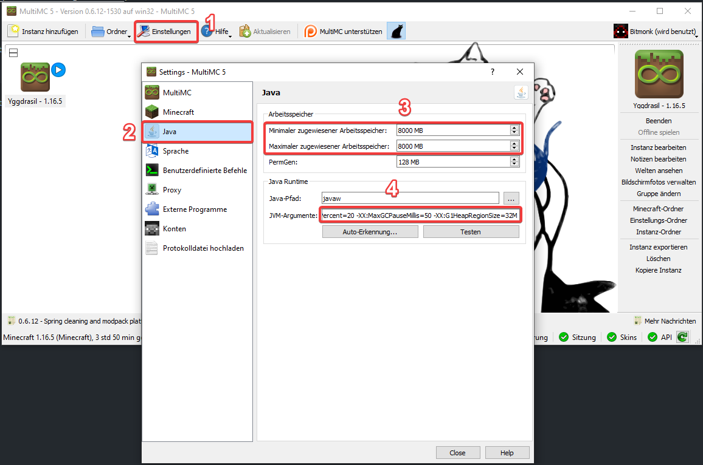

# How-To

## TL;DR - Ich weiß was ich tue

[Eden Modpack - 1.18.2](https://drive.google.com/file/d/13wDIzj6O-OUEkU8S0_r0s0MpQpdZ5HFz/view?usp=sharing)

```
Server Adresse: bitmonk.de
```

## Schritt 1 - MultiMC installieren

[Hier](https://multimc.org/#Download) die aktuellste Version von MultiMC herunterladen und installieren.

> MultiMC ist ein Minecraft-Launcher um mehrere Instanzen zu managen

Dort müsst ihr dann zunächst noch euren Mojang/Microsoft Account verknüpfen. Das könnt ihr über den Knopf ganz rechts oben machen.

## Schritt 2 - Java Args

Um mit einer hohen Anzahl von Mods zu spielen braucht Minecraft (bzw. Java) ausreichend Arbeitsspeicher. Öffne dafür die Einstellungen (1) und dort den Reiter Java (2). Hier siehst du zwei Eingabefelder für den minimalen und maximalen Arbeitsspeicher (3).

Trage in beide Felder mindestens 4000MB ein, bestenfalls 8000MB. Stelle vorher sicher, dass du auch ausreichend Arbeitsspeicher zur Verfügung hast. Wenn du nur insgesamt 8GB Arbeitsspeicher hast probiere erstmal 4000MB oder 6000MB aus, das sollte normalerweise auch schon reichen.

Um noch etwas mehr Performance herauszukitzeln könnt ihr noch folgende JVM-Argumente mitangeben (4):

```
-XX:+UseG1GC -Dsun.rmi.dgc.server.gcInterval=2147483646 -XX:+UnlockExperimentalVMOptions -XX:G1NewSizePercent=20 -XX:G1ReservePercent=20 -XX:MaxGCPauseMillis=50 -XX:G1HeapRegionSize=32M
```

Das ist zwar an sich nicht unbedingt notwendig aber wenn ihr beim Spielen immer mal wieder "ruckler" erlebt können die JVM-Args Abhilfe schaffen.



## Schritt 3 - Instanz herunterladen und importieren

Die MultiMC-Instanz mit allen Mods bekommt ihr Hier:

[Eden Modpack - 1.18.2](https://drive.google.com/file/d/13wDIzj6O-OUEkU8S0_r0s0MpQpdZ5HFz/view?usp=sharing).

Die zip-Datei müsst ihr dann einfach per Drag&Drop in das Fenster vom MultiMC-Launcher ziehen.

## Schritt 4 (Optional) - Client Mods

Neben allen notwendigen Servermods enthält das ModPack auch folgende optionalen Client Mods:

- Controlling
  - Fügt ein Suchfeld bei den Controls hinzu, um einfacher bestimmte Keybindings zu finden
- CraftPresence
  - Fügt Discord Presence hinzu
- Ding
  - Erzeugt ein "Ding"-Geräusch wenn alle Mods fertig geladen sind
- OptiFine
  - FPS- und Grafikoptimierungen sowie Shader-Support
- ReAuth
  - Falls eure Mojang Session mal ausläuft während Minecraft noch offen ist könnt ihr euch damit im Spiel einfach neu einloggen. Das spart das warten beim Neustarten.

Alle Clientmods sind optional und können auch einfach entfernt werden, wenn nicht gewünscht.

## Schritt 5 - Spiel starten und Serverdaten eingeben

Den Server erreicht ihr unter der Adresse `bitmonk.de`. Meldet euch bitte vorher bei mir damit ich euch auf die Whitelist setze.

> Ihr dürft das Modpack gerne auch für euren eigenen Server benutzen

## Beginner Guide

Für Leute die die Mods gar nicht kennen hier ein kurzer Crashcourse:

#### JEI-Interface

Wenn ihr euer Inventar öffnet, seht ihr rechts das JEI-Interface, da findet ihr alle verfügbaren Rezepte für alle existierenden Items und Blöcke. Einfach auf das Item klicken und das Rezept wird angezeigt. In der Suche unten könnt ihr auch nach Items für spezielle Mods suchen indem ihr bspw. "@Mekanism" eingebt, dann werden alle Items und Blöcke von Mekanism angezeigt.

Wenn ihr über ein Item mit der Maus hovered und "u" drückt wird euch außerdem angezeigt, was ihr aus dem jeweiligen Item herstellen könnt. Das ist oft auch ganz nett wenn man ein neues Item findet und nicht weiß was man damit anfangen kann.

Wenn ihr über ein Rezept im JEI-Interface hovered und "a" drückt wird es auf der linken Seite hinzugefügt. So könnt ihr Rezepte "speichern" die ihr häufiger braucht.

#### Journeymap

Journeymap bietet euch die Minimap rechts oben sowie eine große Map wenn ihr 'j' drückt.

Mit dem Keybinding "b" könnt ihr neue Waypoints erstellen. Über "j" und dem Icon in deren unteren Leiste ganz links seht ihr eine Übersicht eurer Waypoints.

Wenn ihr sterbt wird übrigens auch automatisch ein Waypoint für euch erzeugt.

#### Gravestones

Gestorben? Halb so schlimm. Dein gesamtes Inventar wurde gesichert und in einen "Grabstein" gepackt an der Stelle an der du gestorben bist. Der Grabstein ist sicher vor Lava und anderen Gefahren. Sobald ihr den Grabstein zerstört habt ihr automatisch eure Sachen wieder im Inventar.

Im Zweifel habt ihr aber auch ein Orbituary nach dem Tod, solltet ihr durch einen Bug o.ä. gestorben sein und der Grabstein unauffindbar sein, kann ich euch die Items auch direkt wieder erstatten.

#### FTB Chunks

Mithilfe von einigen der FTB-Mods könnt ihr euch Chunks "claimen". Das heißt außer euch kann sonst niemand auf den jeweiligen Chunks Blöcke abbauen oder unfug treiben, ihr könnt allerdings "Allys" hinzufügen damit ihr mit anderen zusammen bauen könnt.

Um Chunks zu claimen geht einfach ins Inventar, links oben ist ein kleiner Karten-Button zu sehen, dort drauf klicken und dann nochmal links oben auf denselben Button. Dann seht ihr einen kleinen Ausschnitt der Karte und könnt dort die Chunks auswählen.

Ihr könnt insgesamt 120 Chunks claimen, ich denke das sollte anfangs reichen. Bei sehr großen Bauprojekten könnt ihr euch aber auch bei mir für noch mehr chunks melden.

#### FTB Teams

Damit andere mit euch zusammen bauen können könnt ihr eine Party erstellen.

```
/ftbteams party create <partyname>
```

Ihr könnte dann andere hiermit einladen:

```
/ftbteams party invite <user>
```

Wenn ihr nun das Inventar öffnet und links oben auf das Icon mit den 3 Männchen klickt solltet ihr ein neues Fenster sehen, dort ist in der oberen rechten Ecke ein Zahnrad, wenn ihr darauf klickt könnt ihr eure Party-Einstellungen ändern. By default können Allies Blöcke setzen und abbauen und auch mit Items interagieren.

#### Interessante erste Mods

- Create
- Botania
  - Bietet nützliche Accessoires die ihr in "Bauble"-Slots unterbringen könnt.
  - Einfach das Lexica Botania craften (In JEI einfach danach suchen)
- Natures Aura
- Mekanism
  - Ore-Vervielfachung und Automatisierung
- SilentGear
  - Verbesserte Werkzeuge mit vielen verschiedenen Traits und Gimmicks

[Zur ganzen Modliste](./modlist.md)
